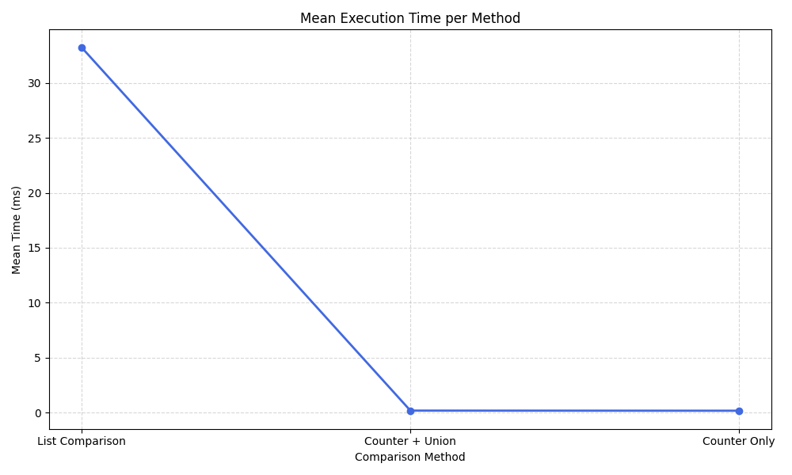

# File_Compare

## Utility
This desktop application features the ability to compare two files and display any unique lines or unique line count, 
regardless of sorted order in either file.  

## Themes
It boasts three themes: Dark, Light, and Purple.
Each one is selectable from the menu and the program will retain the theme selection even after closing until it is
changed by the user. 

## 🚀 Performance Improvements

Comparison of file comparison strategies:

| Method           | Mean (ms) | Min (ms) | Ops/sec |
|------------------|-----------|----------|---------|
| List Comparison  | 33.20     | 32.97    | 30.12   |
| Counter + Union  | 0.180     | 0.176    | 5557.39 |
| Counter Only     | 0.169     | 0.165    | 5920.36 |

Switching from list-based comparison to Counter-based logic improved performance by **~196×**.
